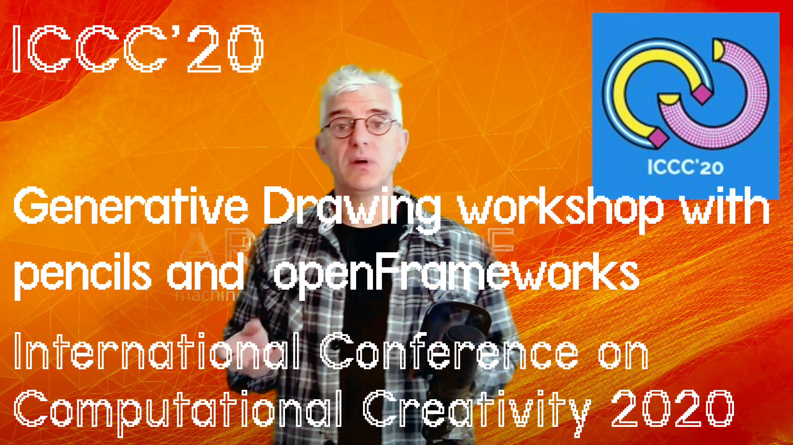

# Workshop: Introduction to Generative Drawing with pencils, paper, C++ and openFrameworks 


## International Conference on Computational Creativity, September 7-11, in Coimbra, Portugal.
[ICCC2020](http://computationalcreativity.net/iccc20/)

### Workshop dates: Monday 7 September
 - 11:00-13:00 Group Video session: Welcome, overview and start discussion on personal generative drawing ideas
 - 14:00- 16:00 drop in support channel with workshop organisers available (optional)
 - 16:00-18:00 Group Video session: Sharing, review and presentation of developed ideas
 --------

- Tuesday - Thursday 8-10 September: informal/drop in open chat for sharing personal drawing ideas and code support 
- Friday 9th Online web gallery of produced work presented 

You can watch the full video from the first session online here

https://youtu.be/4Y5q3sZpZTQ




Between sessions the organisers will be following an open channel online for drop in questions and support, after the Monday workshop we will run a side chat/support channel for interested participants and will present any developed work and the captured ideas in a gallery on the workshop website on Friday 9th September

 We will use ZOOM video conferencing (LINK available soon) for the face to face/video parts of the morning and afternoon sessions

 We will be using the ICCC Slack messaging channel https://iccc20.slack.com to exchange code, ideas and provide support and discussion during the period of the conference. You can sign up and use Slack in a browser or phone or desktop app at the address  https://iccc20.slack.com
 

| home | [ examples documentation](example-code) | [ workshop exercise](example-code/README_workshop.md) | [example source code ](https://github.com/generative-drawing/generative-drawing.github.io/tree/master/example-code) |
### Overview

This workshop will introduce participants to the basic principles of generative computational drawing systems and give practical hands on demonstrations of coding simple generative systems for art, music, audio and design using the popular C++ toolkit ['openFrameworks'](https://openframeworks.cc).


Beginning with a discussion of generative approaches to drawing from traditional media, printmaking and weaving, participants in the workshop will gain an insight into some of the long and fascinating history of generative approaches in art. Translating ideas to still images and video, from the work of Printmaker Sol Lewitt, weaver Annie Albers and computational artist Vera Molnar to Eno's generative video and sound using computer systems.
 
This all day workshop is suitable for those with an interesting in coding and a familiarity with basic development on Mac, PC or Linux computers. Demonstration code and examples will be pre-prepared enabling all participants to make their own audio or video/visual generative artwork in the course of the day.

The workshop provides an overview and grounding in the theory, history and application of generative and procedural systems in art and design. This workshop engages participants in a discussion of theory and practical application of systems featuring exemplar material from creative practitioners from the field of music, audio, video, visual arts, architecture, literature and graphic and product design. Through the practice of systems of drawing translated into computational drawing, participants will learn the mathematics and philosophical foundations of algorithmic and generative approaches to creation alongside practical demonstration and experimentation with systems. After joining this workshop participants will be able to select and apply a variety of generative systems techniques to differing situations in their own area of arts and design practice.

   

### Workshop Activity Outline
The workshop will cover the following areas over a whole day or two day period.
- Introduction to generative and procedural systems and discussion of the historical context in relation to drawing and creativity
- including Mozart, Sol Lewitt, Annie Albers, Vera Molnar, John Cage, William Burroughs, Brian Eno, Golan Levin, William Latham, KOAN etc
- Basic systems types and exemplar materials in written form/ paper drawings and in C++, openFrameworks systems and exemplar/demo materials, Stochastics and Random Walks, Markov chains, L systems, Non linear composition.

Activities for participants centre on;

- Participants write rules for pencil drawings and test them on paper
- Participants re-work pencil drawing rules into computer code
- Participants work on expanding demo code to their own area of interest

### Exhibiting the outcomes of the workshop during the symposium

A closing party/mini exhibition show-and-tell will happen at the end of the day to broaden the discussion and make visible individual participants works. If it were possible to access a suitable space to disseminate the works more widely it would be extremely exciting to be able to assemble the pieces from participants for exhibition. This would take the form of generative workshop outcomes. eg hung pencil drawings, written drawing rules and the subsequent generative computer works created. These could be in the form of installation/exhibited videoscreens exhibited alongside the original pencil drawings. Developed work will be documented online in video and code examples. Alongside the source drawings and physical exercises. Documents from all works, with text, photographs, video and source code will be available online after the symposium for future reference and for wider dissemination to interested artists and academics unable to attend the conference.

All demonstration code is available open-source via git gub before and after the workshop for participants to reference and contribute to.

you can see the documentation of the [latest versions of all examples](example-code) and the [main workshop starting exercise here](example-code/README_workshop.md)
and  

code examples include;

* random walkers
* simple drawing agents
* markov Chains
* recursion
* generative colour palettes
* cellular automata
* recreating existing works with examples from Vera Molnar

### Indicative reading list;

```markdown
- Przemyslaw Prusinkiewicz and Aristid Lindenmayer (2004) The Algorithmic Beauty of Plants Springer-Verlag, New York
- Annie Albers. (1974) On Weaving. Wesleyan University Press
- Sol LeWitt: (1977, Reprinted 2019) Four Basic Kinds of Lines & Colour. Primary Information/ Printed Matter, Inc
- Generative Art, Science and Technology hard Journal. http://www.gasathj.com/tiki-index.php
- Casey Reas, Chandler McWilliams (2010) Form+Code in Design, Art, and Architecture
- Montfort et al (2014) 10 PRINT CHR$(205.5+RND(1)); : GOTO 10 (Software Studies)
- Daniel Shiffman (2012) The Nature of Code: Simulating Natural Systems with Processing
- Carl Lostritto, (2019) Computational Drawing, Applied Research & Design Inc

```

### How to Participate
To generate a wider approach to participation entry is open to all intereted parties:

### Fees and registration

Fees for • Workshops and Tutorials
The conference has two price options for those wishing to attend the Workshops and Tutorials:
* Workshops and Tutorials in addition to main Conference (+ W&T);
* Workshops and Tutorials only ( W&T only).

 

|   | + W&T  |  W&T only |
|---|---|---|
| Students  | 25 €  | 45 €  |
| Regular  | 40 €   | 60 €  |

please see [registration at ICCC20](http://computationalcreativity.net/iccc20/registration/) for more details and registration process.
 (*) prices correct at time of writing	
		
### Getting started
You can download the openframeworks C++ toolkit from openframeworks.cc - you can also see extensive documentation, help files and examples there. there is also a helpful and friendly community forum.

You can see introductory videos on getting started using the openFrameworks C++ toolkit on the art&code youtube channel https://youtube.com/danbuzzo
'Creative Coding Toolkit' 
https://www.youtube.com/playlist?list=PL6QF0yo3Zj7ALxV4MyOJ9oSFsV-Mo39R2

If you are new to C++ you can also get super quick introductions to basic programming concepts in the ‘programming for artists’ video series - part one is sketching ideas and programming concepts 
https://www.youtube.com/playlist?list=PL6QF0yo3Zj7C6IB6qFpc4UcO0SvVbyc0H

and part 2 of Programming for artists is starting to code. 

https://www.youtube.com/playlist?list=PL6QF0yo3Zj7DlRpQlfBULd3ngzi-qbLCY

### Organisers

- [Daniel Buzzo](https://people.uwe.ac.uk/Person/DanielBuzzo), University of the West of England
- [Kristina Andersen](https://www.tue.nl/en/research/researchers/kristina-andersen/), Technical University, Eindhoven

for further information please contact [daniel.buzzo@uwe.ac.uk](daniel.buzzo@uwe.ac.uk)
