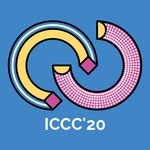
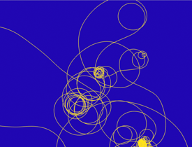
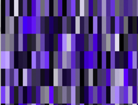
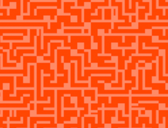
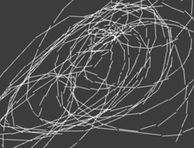

# Workshop: Introduction to Generative Drawing with pencils, paper, C++ and openFrameworks
## International Conference on Computational Creativity, September 7-11, in Coimbra, Portugal.
[ICCC2020](http://computationalcreativity.net/iccc20/)

important dates
- Workshop Submission deadline: 1st of June
- Author notification: 3rd of July
- Workshop dates: 7-11 September



| home | [ examples documentation](example-code) | [ workshop exercise](example-code/README_workshop.md) | [example source code ](https://github.com/generative-drawing/generative-drawing.github.io/tree/master/example-code) |
### Overview

This workshop will introduce participants to the basic principles of generative computational drawing systems and give practical hands on demonstrations of coding simple generative systems for art, music, audio and design using the popular C++ toolkit ['openFrameworks'](https://openframeworks.cc).


Beginning with a discussion of generative approaches to drawing from traditional media, printmaking and weaving, participants in the workshop will gain an insight into some of the long and fascinating history of generative approaches in art. Translating ideas to still images and video, from the work of Printmaker Sol Lewitt, weaver Annie Albers and computational artist Vera Molnar to Eno's generative video and sound using computer systems.
 
This all day workshop is suitable for those with an interesting in coding and a familiarity with basic development on Mac, PC or Linux computers. Demonstration code and examples will be pre-prepared enabling all participants to make their own audio or video/visual generative artwork in the course of the day.

The workshop provides an overview and grounding in the theory, history and application of generative and procedural systems in art and design. This module engages participants in a discussion of theory and practical application of systems featuring exemplar material from creative practitioners from the field of music, audio, video, visual arts, architecture, literature and graphic and product design. Through the practice of systems of drawing translated into computational drawing, participants will learn the mathematics and philosophical foundations of algorithmic and generative approaches to creation alongside practical demonstration and experimentation with systems. After joining this workshop participants will be able to select and apply a variety of generative systems techniques to differing situations in their own area of arts and design practice.

   

### Workshop Activity Outline
The workshop will cover the following areas over a whole day or two day period.
- Introduction to generative and procedural systems and discussion of the historical context in relation to drawing and creativity
- including Mozart, Sol Lewitt, Annie Albers, Vera Molnar, John Cage, William Burroughs, Brian Eno, Golan Levin, William Latham, KOAN etc
- Basic systems types and exemplar materials in written form/ paper drawings and in C++, openFrameworks systems and exemplar/demo materials, Stochastics and Random Walks, Markov chains, L systems, Non linear composition.

Activities for participants centre on;

- Participants write rules for pencil drawings and test them on paper
- Participants re-work pencil drawing rules into computer code
- Participants work on expanding demo code to their own area of interest

### Exhibiting the outcomes of the workshop during the symposium

A closing party/mini exhibition show-and-tell will happen at the end of the day to broaden the discussion and make visible individual participants works. If it were possible to access a suitable space to disseminate the works more widely it would be extremely exciting to be able to assemble the pieces from participants for exhibition. This would take the form of generative workshop outcomes. eg hung pencil drawings, written drawing rules and the subsequent generative computer works created. These could be in the form of installation/exhibited videoscreens exhibited alongside the original pencil drawings. Developed work will be documented online in video and code examples. Alongside the source drawings and physical exercises. Documents from all works, with text, photographs, video and source code will be available online after the symposium for future reference and for wider dissemination to interested artists and academics unable to attend the conference.

All demonstration code is available open-source via git gub before and after the workshop for participants to reference and contribute to.

you can see the documentation of the [latest versions of all examples](example-code) and the [main workshop starting exercise here](example-code/README_workshop.md)
and  

code examples include;

* random walkers
* simple drawing agents
* markov Chains
* recursion
* generative colour palettes
* cellular automata
* recreating existing works with examples from Vera Molnar

### Indicative reading list;

```markdown
- Przemyslaw Prusinkiewicz and Aristid Lindenmayer (2004) The Algorithmic Beauty of Plants Springer-Verlag, New York
- Annie Albers. (1974) On Weaving. Wesleyan University Press
- Sol LeWitt: (1977, Reprinted 2019) Four Basic Kinds of Lines & Colour. Primary Information/ Printed Matter, Inc
- Generative Art, Science and Technology hard Journal. http://www.gasathj.com/tiki-index.php
- Casey Reas, Chandler McWilliams (2010) Form+Code in Design, Art, and Architecture
- Montfort et al (2014) 10 PRINT CHR$(205.5+RND(1)); : GOTO 10 (Software Studies)
- Daniel Shiffman (2012) The Nature of Code: Simulating Natural Systems with Processing
- Carl Lostritto, (2019) Computational Drawing, Applied Research & Design Inc

```

### How to Participate
To generate a wider approach to participation we accept the following types of contributions to the workshop:

- Extended abstract: up to 4 pages in length using the extended abstracts template discussing system or therory approaches to generative design.
- visual or system demonstration: a visual or oral presentation of a piece of related work/works/ as a system, process or artwork.
Please provide a description and illustrative material using the extended abstracts template.

Please submit your contributions using the EasyChair submission section of the ICCC:

[https://easychair.org/conferences/?conf=iccc20](https://easychair.org/conferences/?conf=iccc20)

### Organisers

- [Daniel Buzzo](https://people.uwe.ac.uk/Person/DanielBuzzo), University of the West of England
- [Kristina Andersen](https://www.tue.nl/en/research/researchers/kristina-andersen/), Technical University, Eindhoven

for further information please contact [daniel.buzzo@uwe.ac.uk](daniel.buzzo@uwe.ac.uk)
