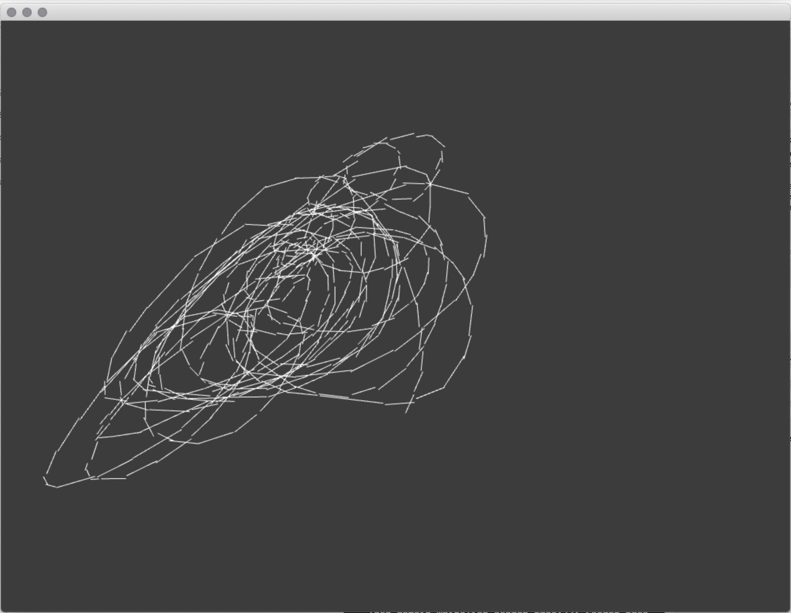
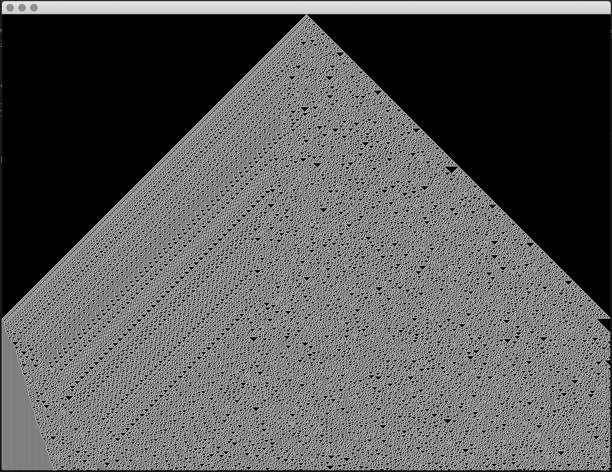
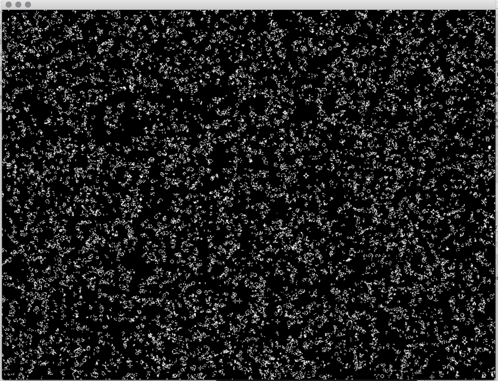
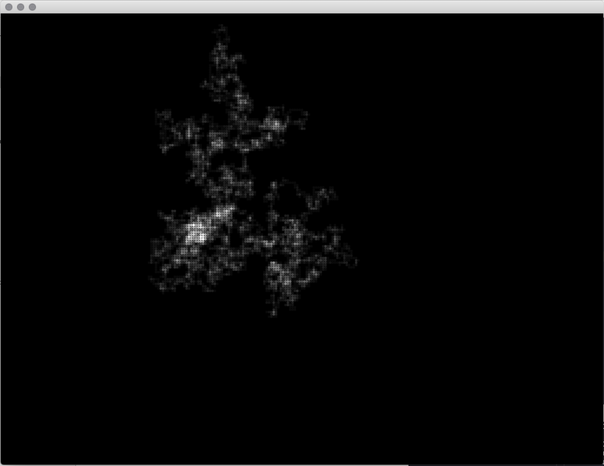
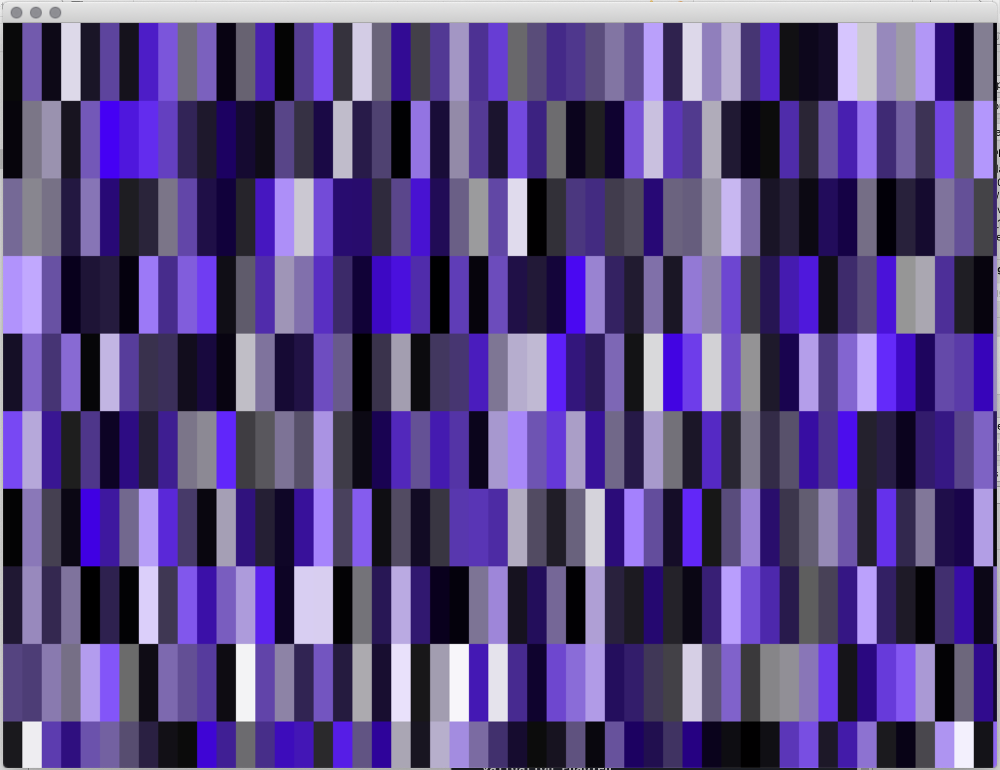
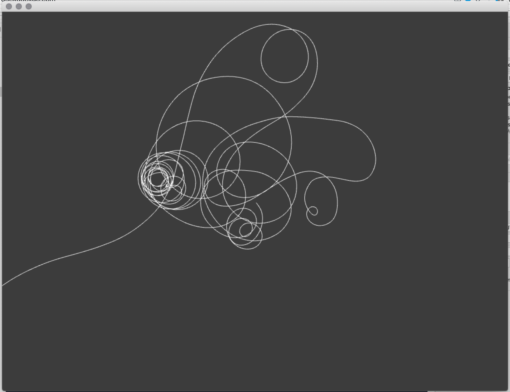
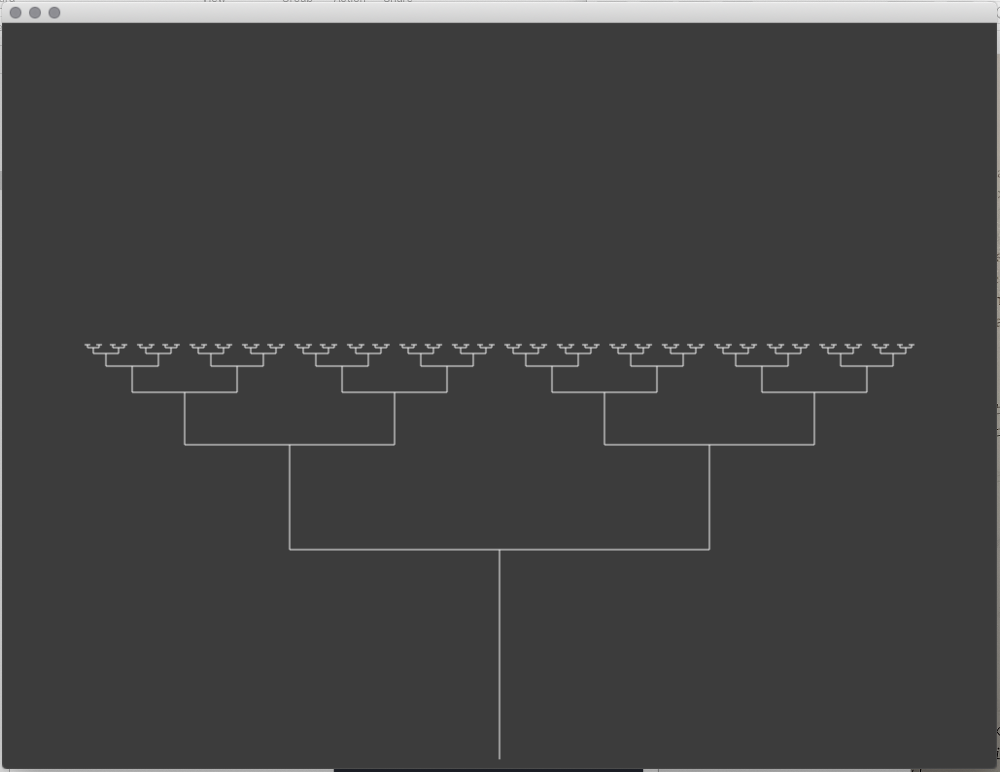
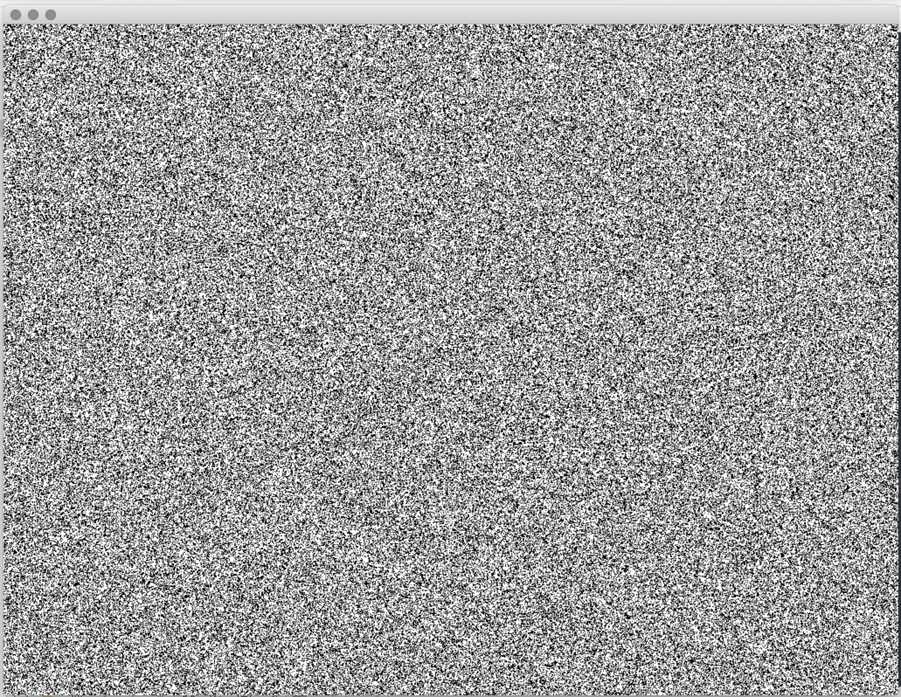

# Workshop: Introduction to Generative Drawing with pencils, paper, C++ and openFrameworks
ICCC2020, Coimbra Portigal September 2020
 
 ©2020 Dan Buzzo
 
 www.buzzo.com
 
 https://generative-drawing.github.io/

| [home](..)| [ examples documentation](example-code) | [ workshop exercise](README_workshop.md) | [example source code ](https://github.com/generative-drawing/generative-drawing.github.io/tree/master/example-code) |

 Examples built in C++ using openFrameworks (openframeworks.cc)

## Visual expression: generative drawing, weaving and pattern making

* Techniques: pattern, walkers, L systems & fractals, conway game of life
* Ideas: generative drawing, editing and pattern making. Making state and extending temporal 'context'
* Demo: random walker, active drawing, Markov Chains built in c++ openFrameworks (openframeworks.cc)
* Examples: Annie Albers, Vera Molnar, Aaron, Jared Tarbell, Zach Lieberman

## Reading
* Annie Albers: https://www.youtube.com/watch?v=E1_fCjuu8sM
* * https://www.youtube.com/watch?v=jaBc8R22JKU
* Vera Molnar: https://www.youtube.com/watch?v=6UUB2kplKOU
* Harold Cohen: History of Aaron painting system : https://web.stanford.edu/group/SHR/4-2/text/cohen.html
https://www.youtube.com/watch?v=ecP9BLg9D88
https://www.youtube.com/watch?v=IPczQgCuOOc
https://www.youtube.com/watch?v=MwHQx9BrHQc
* John Whitney https://www.youtube.com/watch?v=TbV7loKp69s
* markov chains : http://setosa.io/ev/markov-chains/
* Carl Lostrito.'Computational Drawing' 2019, Pub. Applied Research and Design

### Stochastic processes

* Random Walker
* Markov Chain for drawing
* Active Drawing
* Cellular Automata 1D and 2D
* DrunkenAnt Path
  
### Recursion
 * recursionTree
 * recursionDots

### Agents
* termite Agents
* termites as a class

### markov chains
* u-drawMarkov

### recreation examples from the work of Vera Molnar
* quatreElements
* carrés_1972
  

