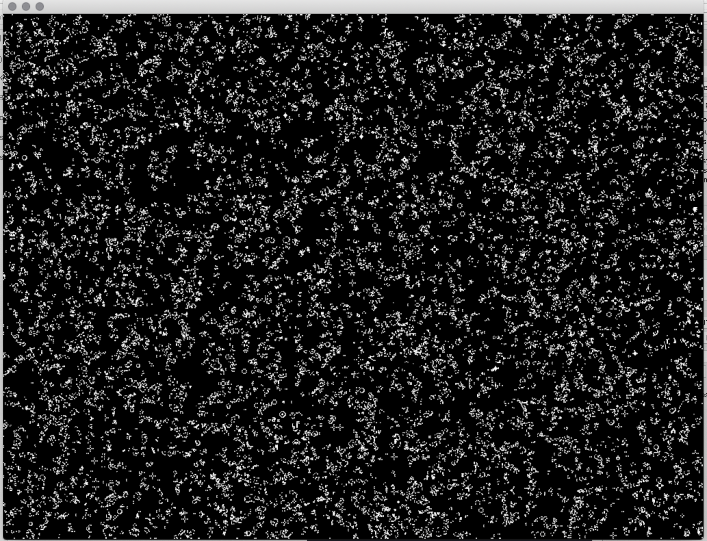

# Workshop: Introduction to Generative Drawing with pencils, paper, C++ and openFrameworks
ICCC2020, Coimbra Portigal September 2020
 
 ©2020 Dan Buzzo
 
 www.buzzo.com
 
 https://generative-drawing.github.io/

## Visual expression: generative drawing, weaving and pattern making

### Cellular Automata2D
based on the example from Casey Reas and Ben Fry in 'Processing, A handbook for visual designers and artists'.

cellular automata that lve or die based on the status of neighbor cells
adapted from Conway's Game of Life

