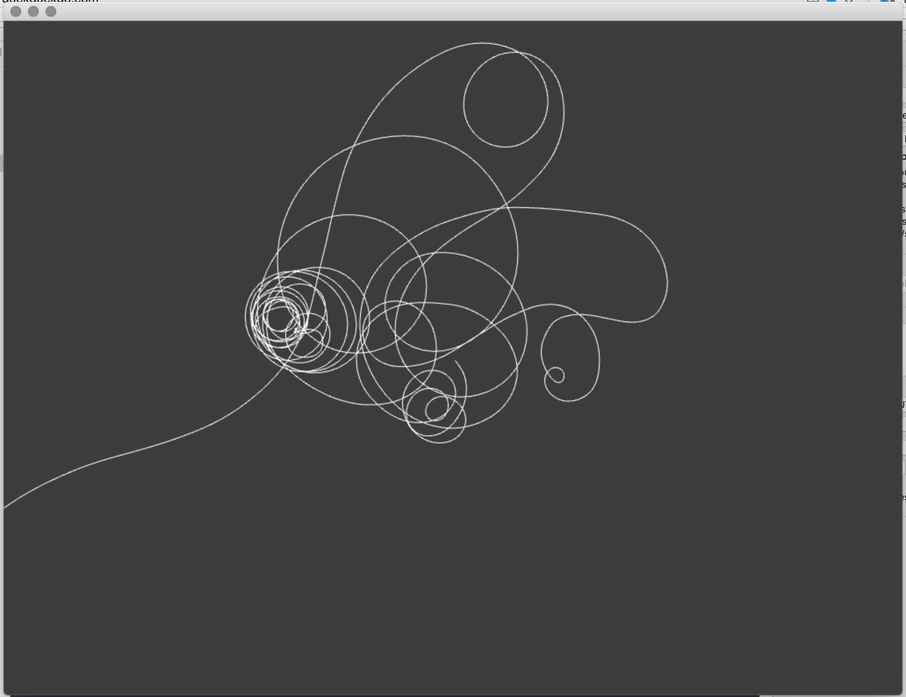

# Workshop: Introduction to Generative Drawing with pencils, paper, C++ and openFrameworks
ICCC2020, Coimbra Portigal September 2020
 
 ©2020 Dan Buzzo
 
 www.buzzo.com
 
 https://generative-drawing.github.io/

## Visual expression: generative drawing, weaving and pattern making

* Techniques: pattern, walkers, L systems & fractals, conway game of life
* Ideas: generative video editing and paint. making state and extending temporal 'context'
* Demo: Drunken Ant Path built in c++ openFrameworks (openframeworks.cc)

### Stochastic processes

* Drunken Ant Path

 adapted from example by Carl Lostrito in 'Computational Drawing'

### controls

* 'f' to toggle fullscreen
* 'r' to reset ant

