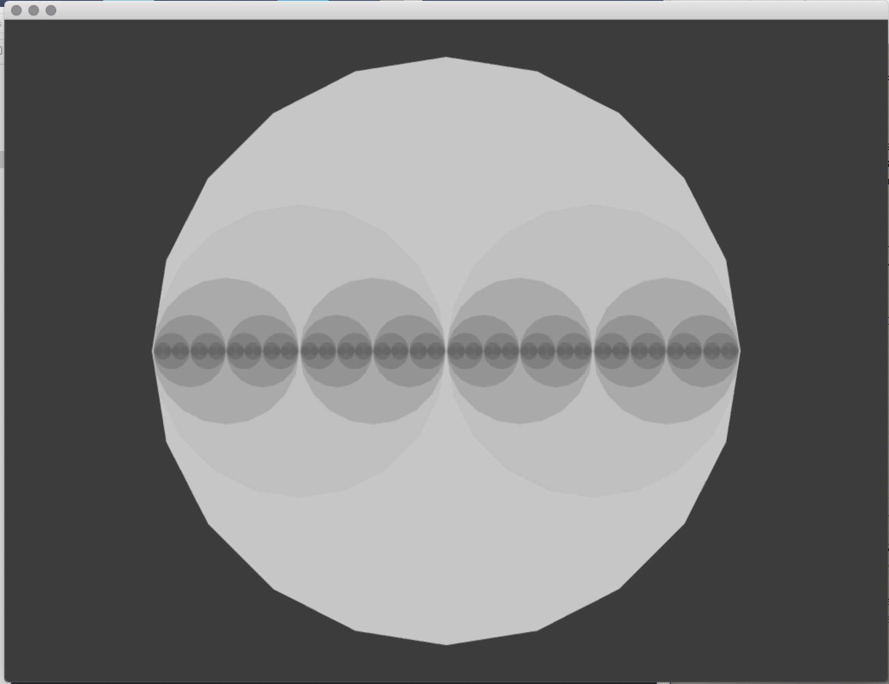

# Workshop: Introduction to Generative Drawing with pencils, paper, C++ and openFrameworks
ICCC2020, Coimbra Portigal September 2020
 
 ©2020 Dan Buzzo
 
 www.buzzo.com
 
 https://generative-drawing.github.io/

## Visual expression: generative drawing, weaving and pattern making

* Techniques: pattern, walkers, L systems & fractals, conway game of life
* Ideas: generative video editing and paint. making state and extending temporal 'context'
* Demo: recursion tree built in c++ openFrameworks (openframeworks.cc)

### Recursion

* recursion Dots

the main function drawDots() calls itself from it's own function creating the branching sphere recursion

we need to stop the recursion from running away so we count down the number of times the function calls itself

