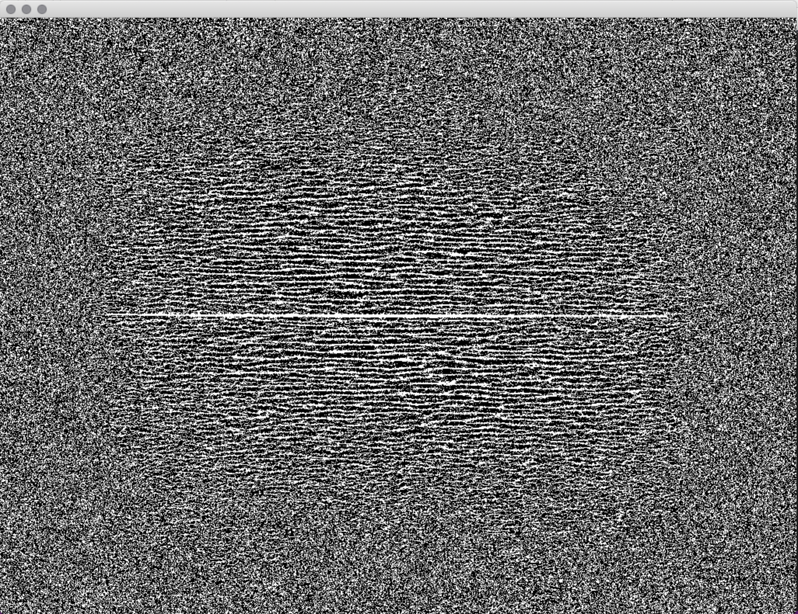

# Workshop: Introduction to Generative Drawing with pencils, paper, C++ and openFrameworks
ICCC2020, Coimbra Portigal September 2020
 
 ©2020 Dan Buzzo
 
 www.buzzo.com
 
 https://generative-drawing.github.io/

## Visual expression: generative drawing, weaving and pattern making

* Techniques: pattern, walkers, L systems & fractals, conway game of life
* Ideas: generative video editing and paint. making state and extending temporal 'context'
* Demo: termite agent example built in c++ openFrameworks (openframeworks.cc)
* inspired by Reas and Fry example in 'Processing:handbook'
*  an extension of the termite agent example recoded as a class

### Agents 

* termite Agents as a class object

this simple example shows agent functions (termites) defiined as a class object sorting randomly distributed 'wood' into organised 'heaps'

