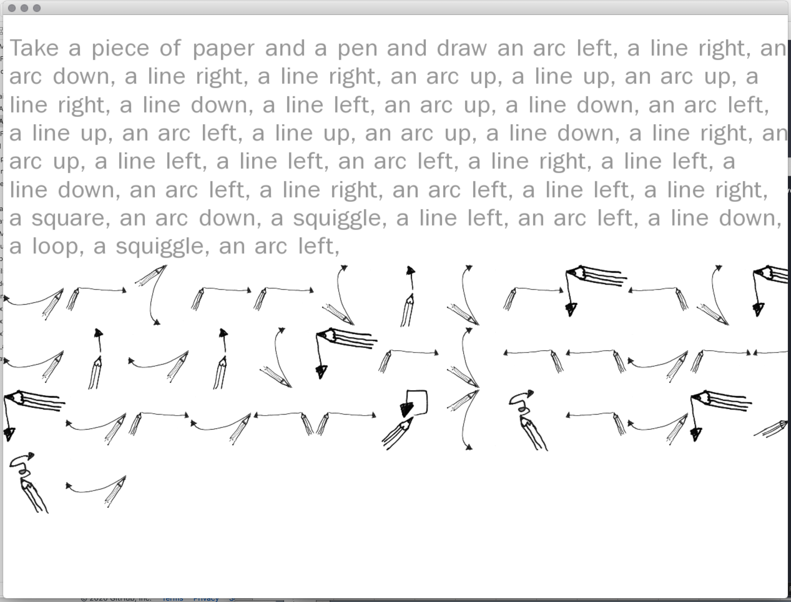
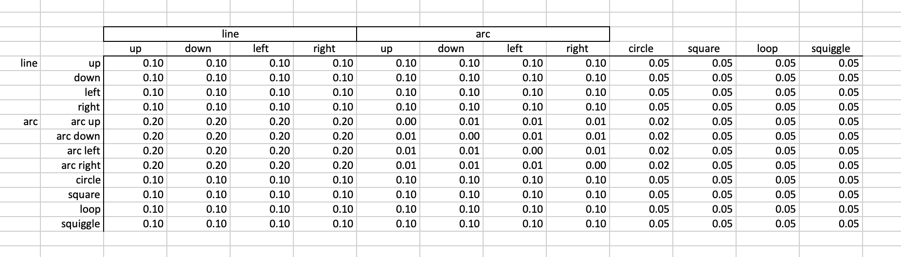

# Workshop: Introduction to Generative Drawing with pencils, paper, C++ and openFrameworks
ICCC2020, Coimbra Portigal September 2020
 
 ©2020 Dan Buzzo
 
 www.buzzo.com
 
 https://generative-drawing.github.io/

# u-DrawMarkov
markov chain drawing sketch in openFrameworks

with 12 x 12 matrix for drawing four orientations of lines and arcs plus squares, circles, loops and squiggles.

with Mac osX speech output announcing each new drawing step.

includes spreadsheet with probability matrix

©2020 Dan Buzzo
github.com/danbz
http://buzzo.com

## dependencies

download these addons and link to your project; 

* ofxMarkovChain   - https://github.com/elaye/ofxMarkovChain

* ofxTextSuite  - https://github.com/Furkanzmc/ofxTextSuite

You can find a helpful walk through of how to use addons in openFrameworks here; https://openframeworks.cc/learning/01_basics/how_to_add_addon_to_project/

## controls

* space: generate new drawing instruction from markov matrix
* g: show / hide gui
* f: toggle fullscreen
* r: reset
* a: autogenerate new drawing steps, at rate of guiSlider 'Speed' 

